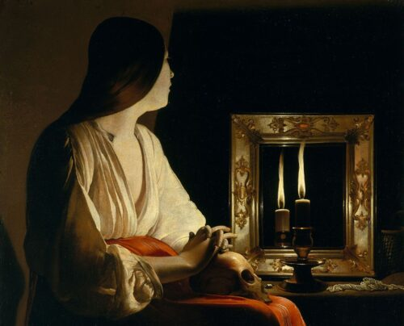

# Peindre et penser la peinture en France durant le premier XVIIe siècle : discours, artistes, concepts

  
  <figcaption><i>La Madeleine aux deux flammes</i>, Georges de La Tour</figcaption>

## Présentation

Entre la fin du XVIe et le milieu du XVIIe siècle, la peinture française connaît de profonds et durables bouleversements. Sous l’impulsion d’Henri IV, Louis XIII et Louis XIV, des régentes Marie de Médicis et Anne d’Autriche et des ministres Richelieu et Mazarin, d’importantes commandes publiques sont lancées. De nombreux édifices religieux sont agrandis, réaménagés ou construits, et de grandes collections privées voient le jour. C’est aussi le moment où une nouvelle génération de peintres émerge en France, au sein de ce que les historiens de l’art ont appelé, depuis la fin du XIXe siècle, le « classicisme » français. Nés en France (Vouet, Poussin, Blanchard, Mignard, Le Sueur, Le Brun), en Lorraine (Claude) ou dans les Pays-Bas espagnols (Champaigne), ces jeunes artistes font connaître leur nom dans l’Europe entière. Mais ils défendent et illustrent également, à leur manière, la naissance d’un art proprement français, toujours nourri des modèles antiques et italiens, mais qui, désormais et de plus en plus, peint, pense et parle en français. Durant le XVIe siècle, une première littérature artistique française est née au contact des textes de Vitruve, d’Alberti et de Serlio, qui sont traduits pour la première fois, ainsi que dans les livres de pourtraiture et de perspective. Mais le premier XVIIe siècle voit l’émergence de nouvelles manières de parler et d’écrire sur la peinture, qui affirment la nécessité de débattre en français des principes et des règles de l’art.

C’est à l’étude systématique de ces premiers discours français sur la peinture, qui n’a jusqu’à présent jamais été menée, que ce projet de recherche est consacré. Il s’agit de battre en brèche l’idée reçue situant la naissance des théories artistiques françaises dans la seconde moitié, voire le troisième tiers du XVIIe siècle. Notre but principal est de mettre en évidence l’importance cruciale de la période allant de la toute fin du XVIe siècle jusqu’aux années 1650 dans la construction d’un nouveau langage artistique français. Trois axes structureront ces réflexions.

L’axe n° 1 rendra compte de la pluralité des discours français sur la peinture de cette période, dans les écrits des artistes professionnels, mais aussi des amateurs et des curieux – historiens, philosophes, poètes, théologiens, etc.. S’appropriant la langue des peintres, ces derniers participent aussi à la diffusion de leurs idées et à la formation du regard des spectateurs français.

L’axe n° 2 analysera la manière dont se sont forgées ces nouvelles manières de penser la peinture. Nous situerons la place des grands artistes antiques et modernes, dont les œuvres ne cessent d’être décrites et analysées, louées ou critiquées, quand elles ne sont pas instrumentalisées pour nourrir de nouvelles théories de l’image politique, littéraire ou sacrée.

Par l’analyse des terminologies employées, l’axe n° 3 abordera les spécificités de ces discours artistiques. Nous étudierons les concepts qu’ils convoquent et en proposant ainsi une autre histoire de l’art français du premier XVIIe siècle, fondée sur les catégories endogènes des acteurs plutôt que des notions instituées par l’histoire de l’art à partir de la fin du XIXe siècle.

Ce projet débouchera sur une thèse de doctorat, la publication de plusieurs centaines de sources anciennes, dont quatre feront l’objet d’une édition critique, les actes de deux journées d’étude et de deux colloques, ainsi que plusieurs autres publications scientifiques et un site web mettant à disposition l’ensemble des sources dépouillées, présentées, commentées et interrogeables par mots-clefs. La collaboration avec des partenaires, en France, en Suisse et en Belgique, permettra de consolider l’investigation à travers l’échange d’informations, de méthodes et de ressources et, à terme, de construire une véritable communauté de chercheurs suisses et européens travaillant sur les arts en France au XVIIe siècle.

## Codes et données

Ce projet Git recense l'ensemble des données et des codes utilisés dans l'objectif de construire une base de données autour des éditions numériques produites.

- Données ALTO : [https://github.com/Grand-Siecle/data_alto](https://github.com/Grand-Siecle/data_alto)
- IIIF Collector: [https://gitlab.unige.ch/grand_siecle/iiif_collector](https://gitlab.unige.ch/grand_siecle/iiif_collector)

## Ressources extérieures

- Blog de recherche : [Grand Siècle Hypotheses](https://grandsiecle.hypotheses.org/)
